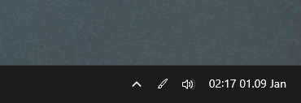

# PowerToys Color Picker Tray

A simple Windows system tray application that launches the Powertoys screenshot application when you click it.



## Development

 ```bash
 # Install dependencies
 npm install

# Run the application
npm start

# Build the application
npm run build:win
```

3. Generate the icon:
   ```bash
   node generate-icon.js
   ```

4. Build the application:
   ```bash
   npm run build:win
   ```

## Project Structure

```
color-picker/
├── main.js              # Electron main process
├── icon.png             # Tray icon (generated)
├── generate-icon.js     # Icon generation script
├── package.json         # Project configuration
└── .github/
    └── workflows/
        └── build.yml    # GitHub Actions workflow
```

## License

MIT License - feel free to use and modify as needed.
